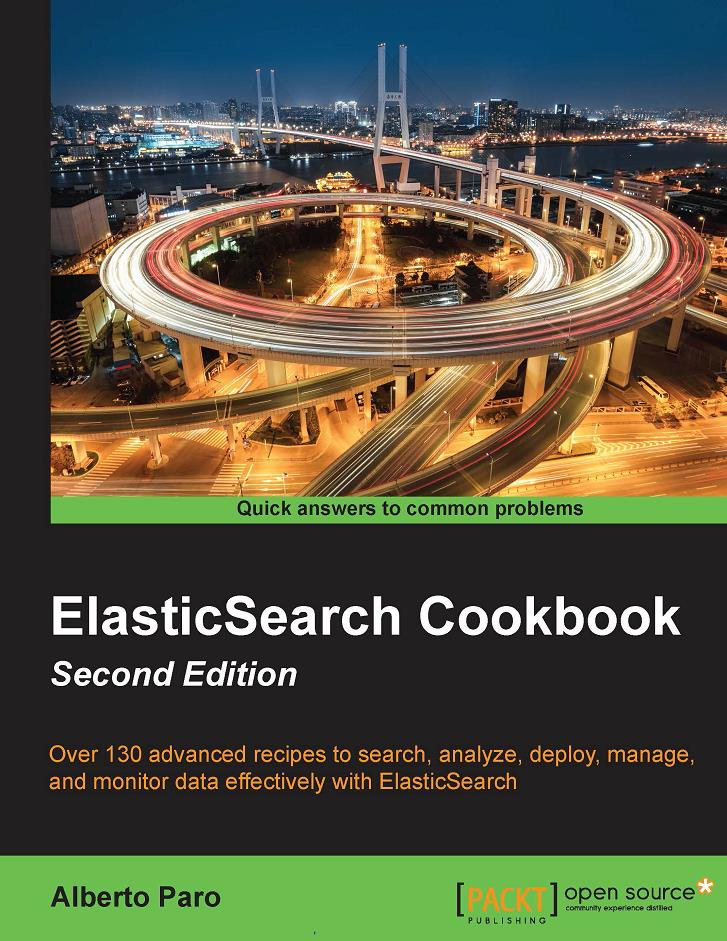

# ElasticSearch_Cookbook 中文版
The Chinese Version For ElasticSearch Cookbook

# 目录

+ [前言](./Preface.md)
+ 第1章 [开始](./1.GettingStarted/README.md)
+ 第2章 下载和安装
+ 第3章 Managing Mapping
+ 第4章 基础操作
+ 第5章 搜索、查询和过滤
+ 第6章 Aggregations
+ 第7章 脚本
+ 第8章 Rivers
+ 第9章 集群和节点监控
+ 第10章 与JAVA整合
+ 第11章 与Python整合
+ 第12章 插件开发
+ 索引

